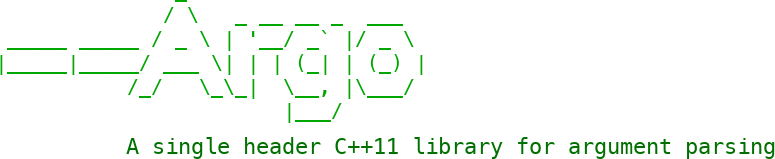

Argo is a single header C++11 library for argument parsing. It is light-weight, flexible, easy-to-use, and has out-of-the-box support for:

* Long-hand (`--foo`) and short-hand notation (`-f`)
* Type safety
* Required arguments
* Optional arguments
* Automatic short-hand generation and guessing of undefined short-hands
* Automatic generation of `--help`, `--version` options
* Automatic type conversions for basic types
* Grouping of options, including inclusive and exclusive groups
* Cardinality: fixed number, one or more, zero or more
* Beautiful output (__`man`__-style)

[Get started right away!](02-basic-usage/)
