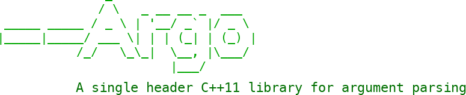

Argo is a single header C++11 library for argument parsing. It is light-weight, flexible, and easy-to-use.

## Features

Out-of-the-box support for:

* Long-hand and short-hand notation
* Type safety
* Required arguments
* Optional arguments
* Automatic short-hand generation and guessing of undefined short-hands
* Automatic generation of `--help`, `--version` options
* Automatic type conversions for basic types
* Grouping of options, including inclusive and exclusive groups
* Cardinality: fixed number, one or more, zero or more
* Beautiful output (__`man`__-style)

A basic example:

```C++
#include "argo/Argo.hpp"
#include <iostream>

using namespace argo;

void count(unsigned int max)
{
    for (unsigned int idx = 1u; idx <= max; ++idx) std::cout << idx << " ";
    std::cout << std::endl;
}

int main(int argc, char **argv)
{
    unsigned int max;
    
    Arguments args;
    handler::Option option{"--number"}.help("Numbers to count");
    option.required().action(action::store(max));
    args.add(option);
    const auto result = args.parse(argc, argv);
    if (!result.success)
    {
        std::cerr << "Error: " << result.message << std::endl;
        return 1;
    }
    else
    {
        count(max);
    }
    return 0;
}
```

Results in the following interaction:


## Requirements

A modern C++11 compliant compiler.

## Integration

Since Argo consists of just a single header file without any external dependencies, no special building or installation steps are required. Simply make the header file available to your project.

### Option 1: Simple

For those wanting to start straight away: clone this repository (or if you're old school you can [download an archive](...) directly). Next, add the `argo/single_include` directory as an include directory to your compiler flags. That's it! You can now include Argo in your C++ projects:

```C++
#include "argo/Argo.hpp"
```

### Option 2: CMake

#### Using Git submodules

When adding the Argo repository as a Git submodule, it suffices to add the Argo repository as a subdirectory in your project:

```CMake
add_subdirectory(argo)
```
This will create the target `Argo` as an `interface` library.

That's it! You can now link your targets against `Argo`:

```CMake
target_link_libraries(my-app PRIVATE Argo)
```

__Note__ If required, you can also build Argo as a static library by setting `ARGO_STATIC_LIB:BOOL=TRUE`. Aside from slightly reduced compilation times, there's no compelling reason in doing so. As such, the header-only approach is recommended.

#### Using ExternalProject_Add

Alternatively, a pure CMake integration is also possible via CMake's `ExternalProject_Add`:

```CMake
cmake_minimum_required(VERSION 3.5)

project(App)

include(ExternalProject)
find_package(Git REQUIRED)
ExternalProject_Add(Argo
    PREFIX ${CMAKE_CURRENT_BINARY_DIR}/extern/argo
    GIT_REPOSITORY https://github.com/dgrine/Argo
    TIMEOUT 10
    UPDATE_COMMAND ${GIT_EXECUTABLE} pull
    CONFIGURE_COMMAND ""
    BUILD_COMMAND ""
    INSTALL_COMMAND ""
    LOG_DOWNLOAD ON
)
ExternalProject_Get_Property(Argo SOURCE_DIR)
set(ARGO_ROOT ${SOURCE_DIR})

add_executable(app ${CMAKE_CURRENT_LIST_DIR}/src/main.cpp)
add_dependencies(app Argo)
#set_target_properties(app PROPERTIES CXX_STANDARD 11) #Your project should be C++ >= 11
target_include_directories(app PRIVATE ${ARGO_ROOT}/single_include)

```

## License

```
MIT License

Copyright (c) 2018 D. Grine

Permission is hereby granted, free of charge, to any person obtaining a copy
of this software and associated documentation files (the "Software"), to deal
in the Software without restriction, including without limitation the rights
to use, copy, modify, merge, publish, distribute, sublicense, and/or sell
copies of the Software, and to permit persons to whom the Software is
furnished to do so, subject to the following conditions:

The above copyright notice and this permission notice shall be included in all
copies or substantial portions of the Software.

THE SOFTWARE IS PROVIDED "AS IS", WITHOUT WARRANTY OF ANY KIND, EXPRESS OR
IMPLIED, INCLUDING BUT NOT LIMITED TO THE WARRANTIES OF MERCHANTABILITY,
FITNESS FOR A PARTICULAR PURPOSE AND NONINFRINGEMENT. IN NO EVENT SHALL THE
AUTHORS OR COPYRIGHT HOLDERS BE LIABLE FOR ANY CLAIM, DAMAGES OR OTHER
LIABILITY, WHETHER IN AN ACTION OF CONTRACT, TORT OR OTHERWISE, ARISING FROM,
OUT OF OR IN CONNECTION WITH THE SOFTWARE OR THE USE OR OTHER DEALINGS IN THE
SOFTWARE.
```

